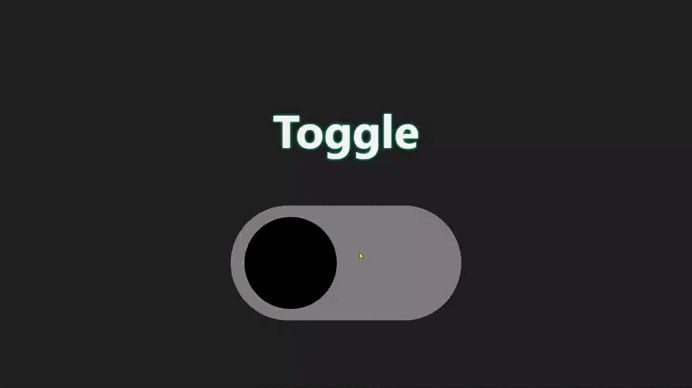

# Challenge #2 - Toggle ✅

In today’s challenge, we’ll create a CSS only toggle.

## *Solution*

| [Live site](https://mendezpvi.github.io/adv-css-2024/challenge-02/) |
| --- |

---
[🔙 Index](../README.md)