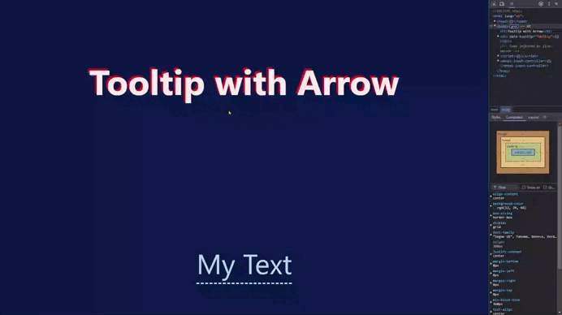

# Challenge #3 - Tooltip with Arrow

## *Requirements*

+ When you hover over the text, the tooltip should appear.
+ When you roll off the text, the tooltip should disappear.
+ There are no additional project files today. Everything, including the arrow should be created with CSS.

## *Solution*

| [Live site](https://mendezpvi.github.io/advent-of-css-2024/challenge-03/) |
| --- |

---
[🔙 Index](../README.md)