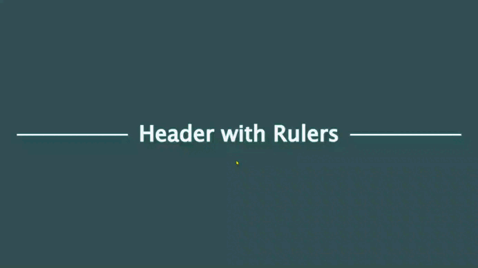

# Challenge #4 - Header with Rulers

Today’s challenge is to style a heading with rulers on either side of the heading.

## *Requirements*

+ This challenge is going to be a little different because I’m providing the HTML:

  ```html
  <h1>Heading</h1>
  ```


## *Solution*

| [Live site](https://mendezpvi.github.io/advent-of-css-2024/challenge-04/) |
| --- |



---
[🔙 Index](../README.md)