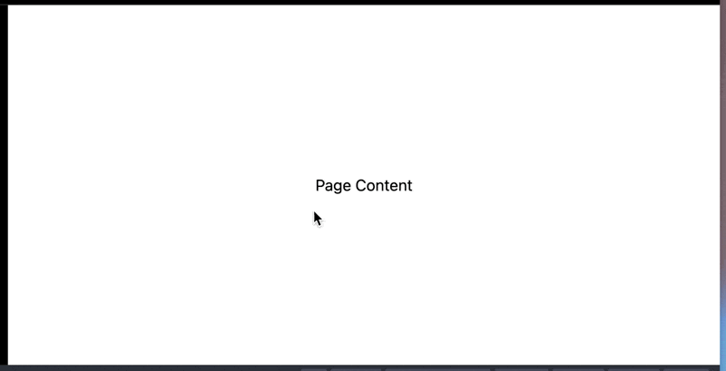
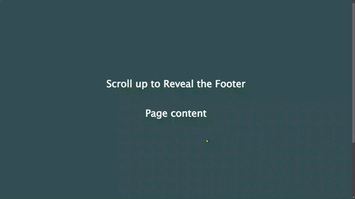

# Challenge #5 - Scroll up to Reveal the Footer

Today’s challenge is to code a footer that is revealed when the user scrolls down.

## *Requirements*

+ The footer content sticks to the bottom and is underneath the content.
+ When the user scrolls up, the content reveals the footer below.

## *Solution*

| [Live site](https://mendezpvi.github.io/advent-of-css-2024/challenge-05/) |
| --- |

---
[🔙 Index](../README.md)